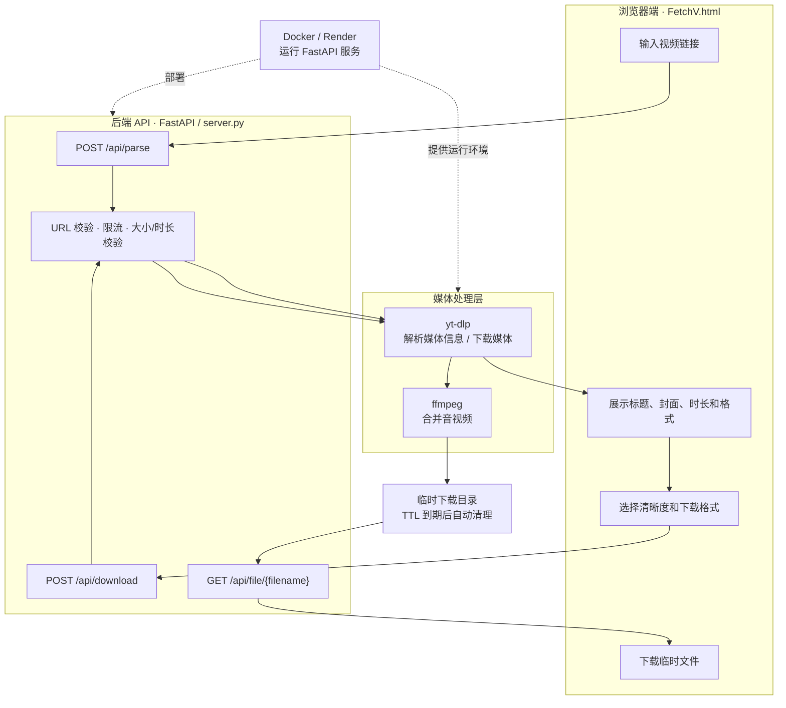

# FetchV

一个前后端分离的视频信息解析与下载服务：前端负责输入链接、展示媒体信息和选择清晰度，FastAPI 后端负责使用 yt-dlp 解析媒体并在需要时调用 ffmpeg 合并音视频。

在线演示：[fetchv.mkang.asia](https://fetchv.mkang.asia)

开发者指南：[FetchV-developer-guide.md](./FetchV-developer-guide.md)

## 功能

- 粘贴视频链接并解析标题、封面、作者、时长和可用格式。
- 先解析、后下载，用户可以在产生大文件前选择清晰度和格式。
- 服务端重新校验媒体信息、时长、格式和文件大小，避免只信任客户端参数。
- 使用随机任务文件名和临时下载目录，下载完成后通过临时 URL 返回文件。
- 支持本地运行和 Docker/Render 部署配置。
- 对解析和下载请求进行按 IP 限流，并自动清理过期文件。

## 技术栈

**Python · FastAPI · yt-dlp · ffmpeg · HTML/CSS/JavaScript · Docker · Render**

## 架构



## 本地运行

要求：

- Python 3.12 或兼容版本；
- `yt-dlp` 可执行文件在 PATH 中；
- `ffmpeg` 已安装并可执行。

PowerShell：

```powershell
python -m venv .venv
.\.venv\Scripts\Activate.ps1
python -m pip install -r requirements.txt
python -m uvicorn server:app --host 127.0.0.1 --port 10000
```

打开 `http://127.0.0.1:10000/`。

## Docker 运行

```powershell
docker build -t fetchv .
docker run --rm -p 10000:10000 fetchv
```

## 运行配置

| 环境变量 | 作用 |
| --- | --- |
| `FETCHV_DOWNLOAD_DIR` | 临时下载目录 |
| `FETCHV_COOKIE_FILE` | 服务端本地 Cookie 文件路径，可选 |
| `FETCHV_COOKIES_B64` | 服务端注入的 Base64 Cookie 内容，可选 |
| `FETCHV_DOWNLOAD_TTL_SECONDS` | 临时文件保留时间，默认 1800 秒 |
| `RENDER` | Render 环境标记 |
| `PORT` | Web 服务端口，默认 10000 |

Cookie、API Key 和其他凭证只应通过部署平台的环境变量或本地未跟踪文件提供，不能写入源码、README、日志或 Git 历史。

## 默认限制

- 每个 IP 每小时最多解析 5 次；
- 每个 IP 每小时最多下载 2 次；
- 视频时长最多 15 分钟；
- 目标文件最大 300 MB；
- 解析超时 90 秒，下载超时 600 秒；
- 临时文件默认 30 分钟后清理。

## 部署说明

仓库包含 `Dockerfile` 和 `render.yaml`。部署前需要确认运行环境能够安装 ffmpeg、执行 yt-dlp、访问目标平台，并理解免费实例的休眠、临时磁盘和请求超时限制。

## 安全与合规

- 只在服务端读取 Cookie，不向浏览器返回 Cookie 内容。
- 不要提交 Cookie 文件、Base64 Cookie、API Key 或任何账户凭证。
- 下载功能应遵守目标平台服务条款、版权要求和当地法律。
- 临时下载链接不是永久存储链接，文件会在 TTL 到期后清理。

## 许可证

本项目当前未声明独立开源许可证。公开仓库前应根据实际授权情况补充许可证，或明确标注为仅供学习和个人使用。
